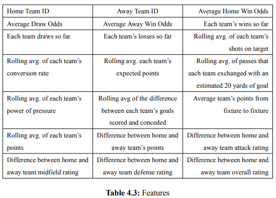
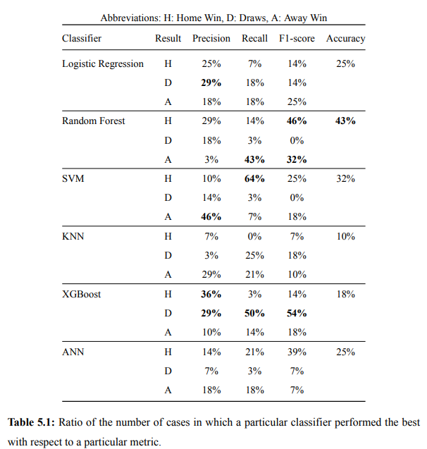

# Football Match Result Prediction Using Machine Learning Techniques

My diploma thesis for the completion of my Integrated Master`s degree in Electrical and Computer Engineering.

In recent years, football match predictions have become increasingly popular. With the help
of data and machine learning techniques, predictions have become more accurate. The availability
of data and the rise of social media have also made it easier for fans and sports betting
companies to access it. In this thesis, I developed machine learning methods that I trained using publicly available data for the 4 main European 
football leagues to predict the outcome of football matches.

## Code and Packages

**Python version:** 3.9.13

**Packages:** Pandas, Numpy, Sklearn, Matplotlib, Seaborn

## Datasets 
We used three publicly available datasets to develop the features we later used to train
the models. The first dataset contained information on game statistics and betting odds (football-data.uk.com). The
second dataset contained information on team dynamics for each league (FIFA Index), and the third dataset
contained information on advanced football statistics (Understats Data).

## EDA

In this step I did data exploration for the 4 European football leagues to better understand the datasets. The results of the EDA for the different championships, are in the eda folder.

## Testing Scenarios

To study the classifiers’ performance we considered 2 scenarios. In the first scenario,
we are attempting to predict the game results of the last 2 seasons for the aforementioned
leagues. In order to do that, we performed a simple train test split on the dataset, using the
first 4 seasons as the training set and the last 2 as the test set. Figure 4.1 depicts the ratio of
each class in the four datasets

  

In the second scenario, we decided to consider each season separately. The Premier
League, Serie A, and La Liga seasons consist of 2 rounds of 19 fixtures each. Unlike the
other 3 leagues, the Bundesliga seasons consist of 2 rounds of 17 fixtures each due to the
smaller number of teams. In this scenario, we use the first round of each season as training
data and the second round as test data. Figure 4.2 shows the ratio of each class for the 4
leagues in season 2018/2019.

  

## Data Prepocessing 

After data collection, the data were reviewed to resolve any issues that might exist. Because we didn’t want to delete any rows from the dataset that contain null values we had to
manually retrieve the missing values using the websites Flashcore and Understats. We then proceeded to the creation of new features. The table below shows the feature that we have created. 
For better understanding of the different features, you can read the section 4.3.1 of the pdf file.

  

## Feature Selection 

Since we ended up with a total of 36 features, we performed feature selection to find the
most relevant ones. The method we proceed with is Recursive Feature Elimination (RFE). Based on an estimator
of our choice (e.g Decision Trees) that assigns weights to the features, the objective of RFE is
to select features by recursively considering smaller and smaller sets of attributes [23]. 

## Examined Models 

The models used for this thesis are:
- Logistic Regression
- Support Vector Machines
- Random Forest
- K-Nearest Neighbors
- XGBoost
- Artificial Neural Networks

To evaluate the model results I used **precision, recall, accuracy, F1-score and AUC score.**
To improve the performance of the models, we tuned different hyperparameters using **GridSearchCV**. In the case of Random Forest and XGBoost, due to the large number of hyperparameters to be tuned and the wide range of values they
can take, we first implemented **RandomisedSearchCV** to narrow down the options and then **GridSearchCV**.

## Results

The table below shows the results for each classifiers when it comes to precision, recall, F1-Score and accuracy.

  

##  Conclusion 

In our research, Random Forest achieved the best results in terms of overall accuracy,
F1-score for home and away wins, and recall for away wins. XGboost performed best in
terms of accuracy, recall, and F1-score for draws and precision for home wins. SVM did
well concerning precision for away wins and recall for home wins. If someone wants to use a
model for a betting activity, we would recommend Random Forrest, as it achieved the highest
accuracy in both scenarios.

## Future Work

Although our model has shown promising results in predicting the outcome of football
games, it could be further improved if we had more data. That data could include information
about each team’s players, weather conditions, motivation to win the game, injuries, etc. That
could also help improve the performance of our ANN, which did not perform well due to the
small amount of data. In addition, in the future, we might try to implement an RNN with
LSTMs, which according to various studies has good potential for predicting football game
results.

